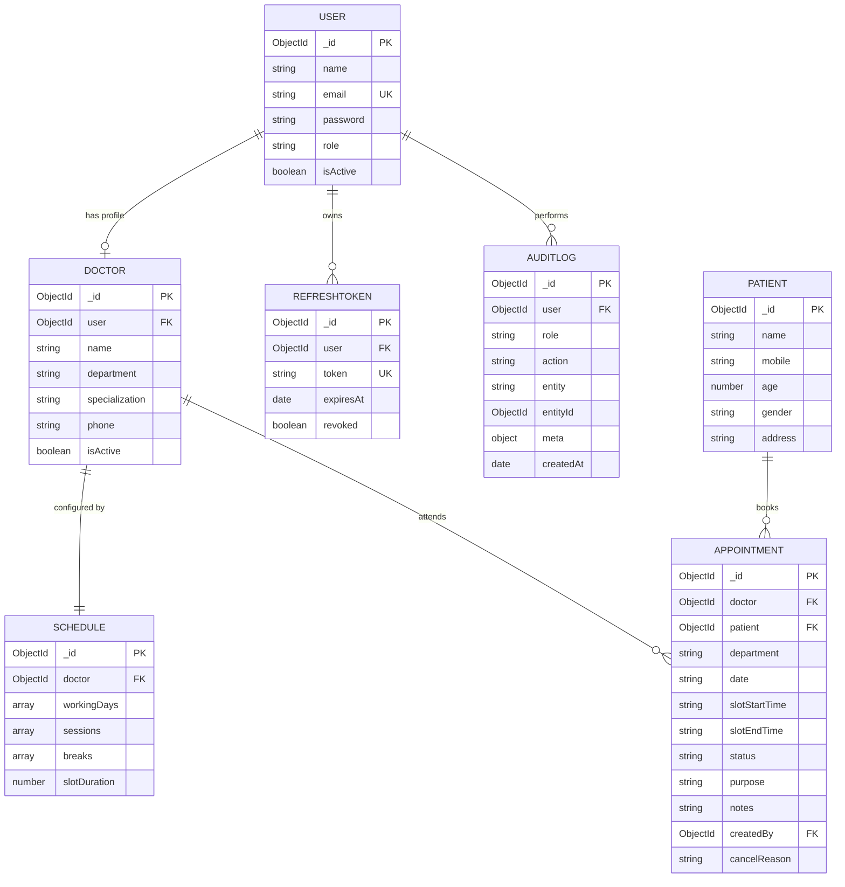

# Database Design

MongoDB (via Mongoose), 7 collections. Diagram below uses Mermaid ER syntax — renders
natively on GitHub and most Markdown viewers that support Mermaid.

## Entity-Relationship Diagram



## Relationship Summary

- **User ↔ Doctor** — one-to-one (optional). Only `role: "doctor"` users have a
  corresponding `Doctor` document. Kept as two collections rather than one merged
  document to separate authentication concerns from clinical profile data.
- **Doctor ↔ Schedule** — one-to-one, enforced by a `unique` index on
  `Schedule.doctor`. Each doctor has exactly one active schedule configuration.
- **Doctor ↔ Appointment** — one-to-many. A doctor can have many appointments; each
  appointment belongs to exactly one doctor.
- **Patient ↔ Appointment** — one-to-many. A patient can have many appointments
  across their history; each appointment belongs to exactly one patient.
- **User ↔ RefreshToken** — one-to-many. A user may have multiple active refresh
  tokens (e.g. logged in on multiple devices); each is independently revocable.
- **User ↔ AuditLog** — one-to-many. Every logged action references the acting user.

## Why This Shape

The schema mirrors the domain model described in the assessment directly rather than
over-normalizing or over-embedding:

- **Not embedded:** `Schedule` is a separate collection from `Doctor`, and
  `Appointment` references `Doctor`/`Patient` by ID rather than embedding their data.
  This avoids document-size bloat as a doctor accumulates appointments, and avoids
  needing to update embedded copies of doctor/patient data in multiple places if their
  details change.
- **Not over-normalized:** appointment `department` is stored as a plain string
  directly on the `Appointment` (rather than requiring a join to `Doctor` to know
  which department an appointment was in), since department is a simple, rarely
  changing attribute captured at booking time — a reasonable denormalization that
  keeps the most common query (list appointments by department) a single-collection
  query.
- **The `Appointment` collection is the busiest, most-queried collection** in the
  system, so its indexes were the most carefully considered (see
  `ENGINEERING_DECISIONS.md` for the full index rationale) — in particular the unique
  partial index that provides the double-booking guarantee at the database layer.

## Sample Documents

**User**
```json
{
  "_id": "665f0a1b2c3d4e5f6a7b8c9d",
  "name": "Dr. Anu Nair",
  "email": "anu@emr.com",
  "password": "$2a$10$hashedvalue...",
  "role": "doctor",
  "isActive": true,
  "createdAt": "2026-07-01T08:00:00.000Z"
}
```

**Doctor**
```json
{
  "_id": "665f0b1b2c3d4e5f6a7b8c9e",
  "user": "665f0a1b2c3d4e5f6a7b8c9d",
  "name": "Dr. Anu Nair",
  "department": "Cardiology",
  "specialization": "Interventional Cardiology",
  "phone": "9000000000",
  "isActive": true
}
```

**Schedule**
```json
{
  "_id": "665f0c1b2c3d4e5f6a7b8c9f",
  "doctor": "665f0b1b2c3d4e5f6a7b8c9e",
  "workingDays": ["Mon", "Tue", "Wed", "Thu", "Fri"],
  "sessions": [
    { "name": "Morning", "startTime": "09:00", "endTime": "12:00" },
    { "name": "Evening", "startTime": "13:00", "endTime": "17:00" }
  ],
  "breaks": [{ "startTime": "12:00", "endTime": "13:00" }],
  "slotDuration": 15
}
```

**Patient**
```json
{
  "_id": "665f0d1b2c3d4e5f6a7b8ca0",
  "name": "Ravi Kumar",
  "mobile": "9876543210",
  "age": 34,
  "gender": "Male"
}
```

**Appointment**
```json
{
  "_id": "665f0e1b2c3d4e5f6a7b8ca1",
  "doctor": "665f0b1b2c3d4e5f6a7b8c9e",
  "patient": "665f0d1b2c3d4e5f6a7b8ca0",
  "department": "Cardiology",
  "date": "2026-07-20",
  "slotStartTime": "09:00",
  "slotEndTime": "09:15",
  "status": "Scheduled",
  "purpose": "Chest pain follow-up",
  "createdBy": "665f0f1b2c3d4e5f6a7b8ca2",
  "createdAt": "2026-07-12T10:00:00.000Z"
}
```

**AuditLog**
```json
{
  "_id": "665f101b2c3d4e5f6a7b8ca3",
  "user": "665f0f1b2c3d4e5f6a7b8ca2",
  "role": "receptionist",
  "action": "APPOINTMENT_CREATED",
  "entity": "Appointment",
  "entityId": "665f0e1b2c3d4e5f6a7b8ca1",
  "meta": {},
  "createdAt": "2026-07-12T10:00:00.000Z"
}
```
